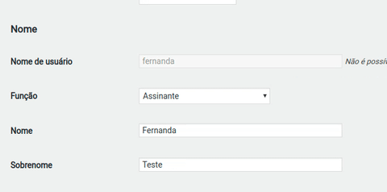

# next-profile

Plugin Wordpress para adicionar um profile extra e utilizar get_the_author_meta para recuperar um substatus especifico a sua necessidade.

```php
<?php 
    get_the_author_meta( 'extra_profile', $profileuser->ID );
?>
```
| Software  | Version |
|-----------|---------|
| Wordpress | 5.2     |
| PHP       | 7.2     |

@author
*André Luiz Pereira*

Gostou do petisco? A Next4 pode criar extensões de alto nível, de forma estável e segura, fale com nossa equipe comercial e deixe o desenvolvimento com a [Next4 Agencia de Marketing Digital](https://www.next4.com.br)

### Exemplo:



